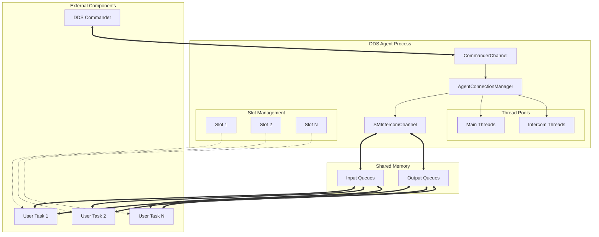
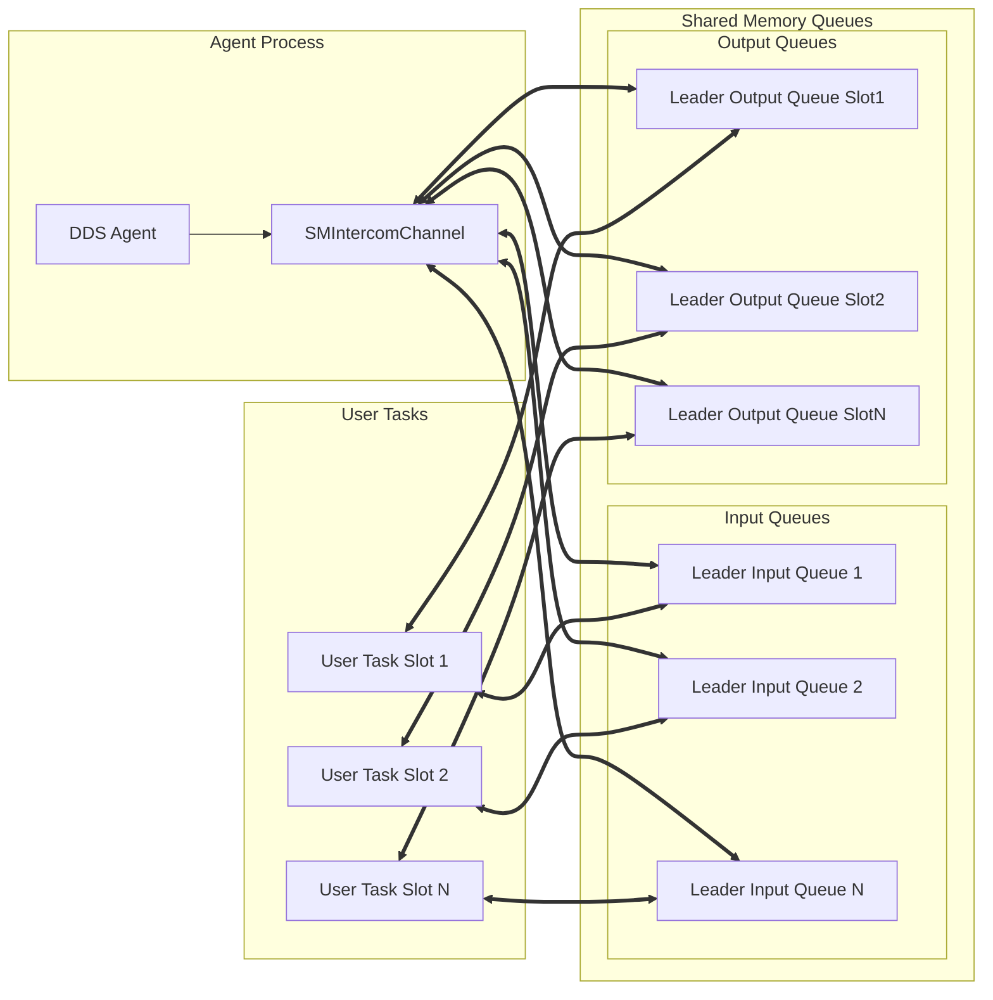
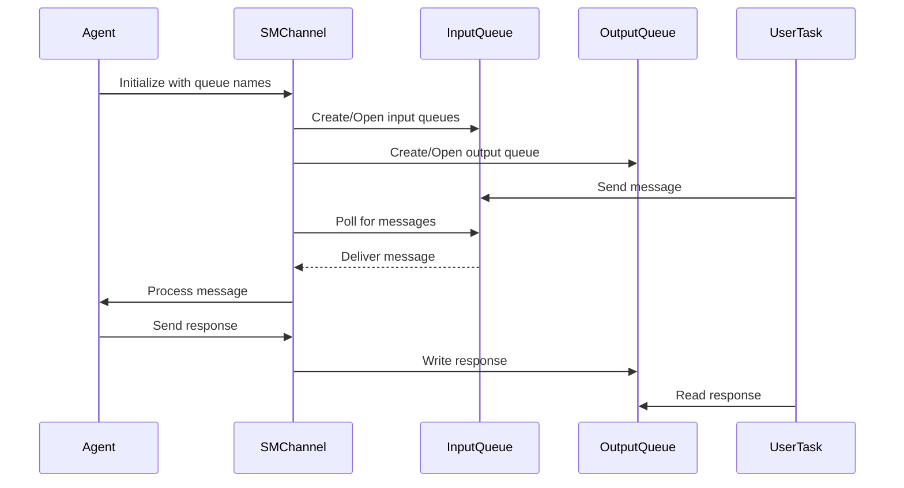
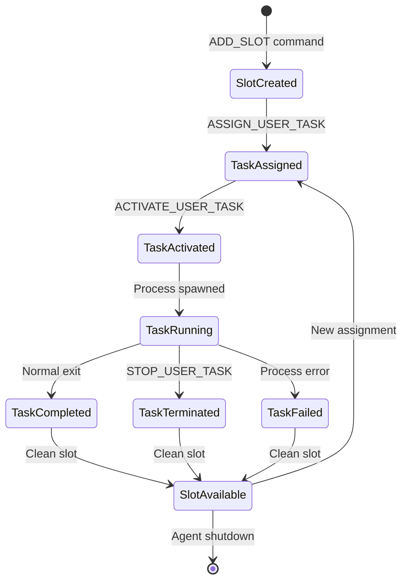
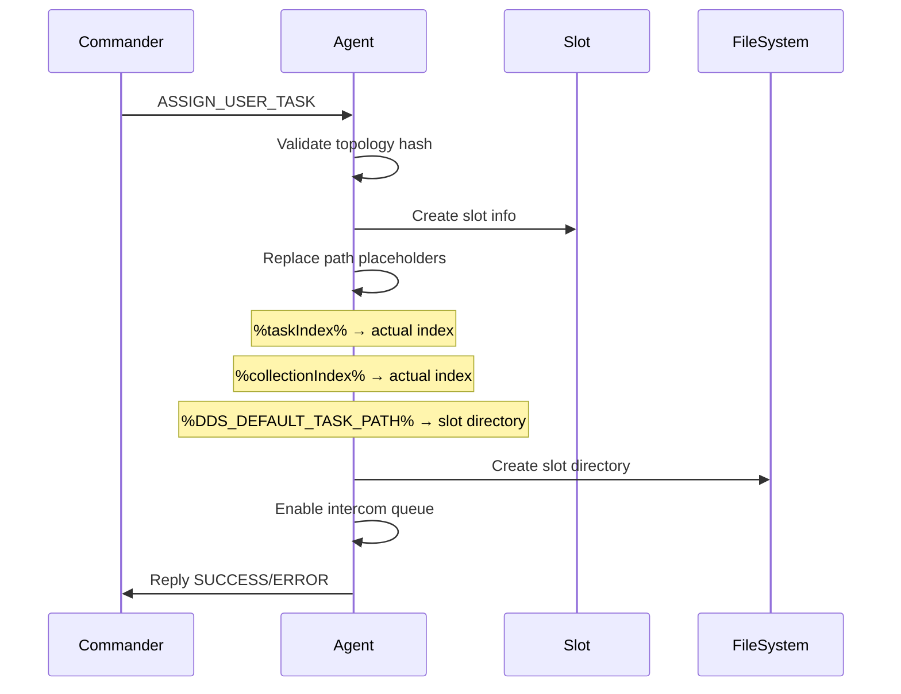
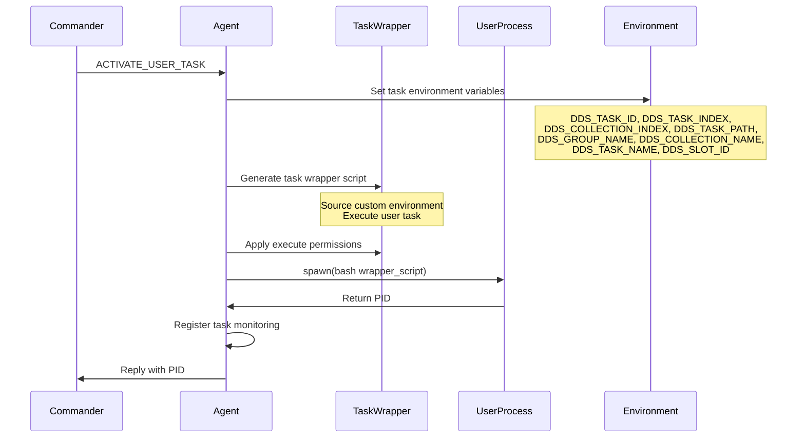
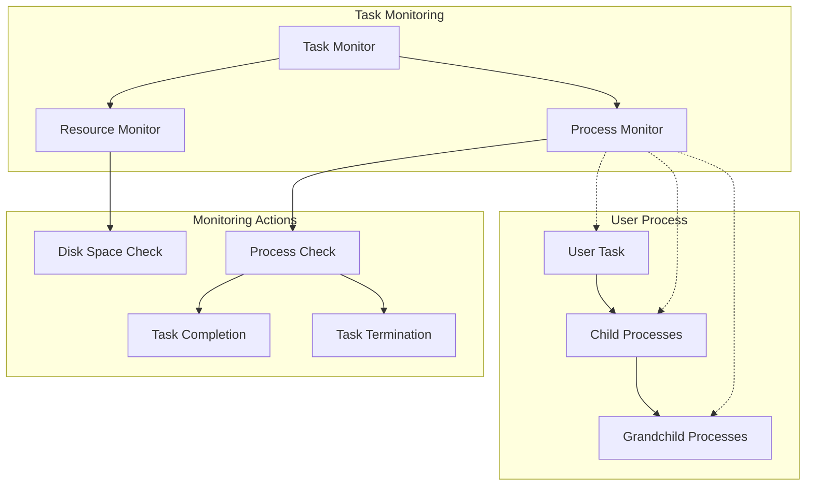
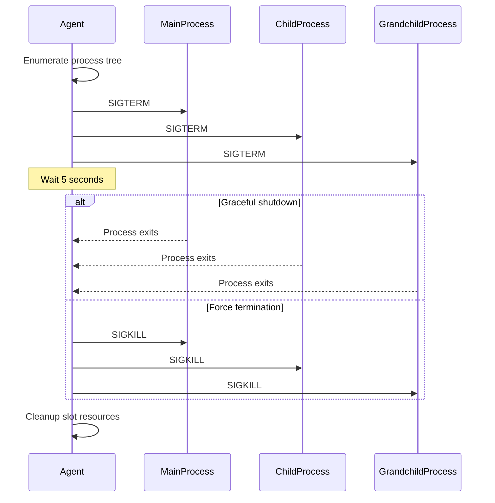
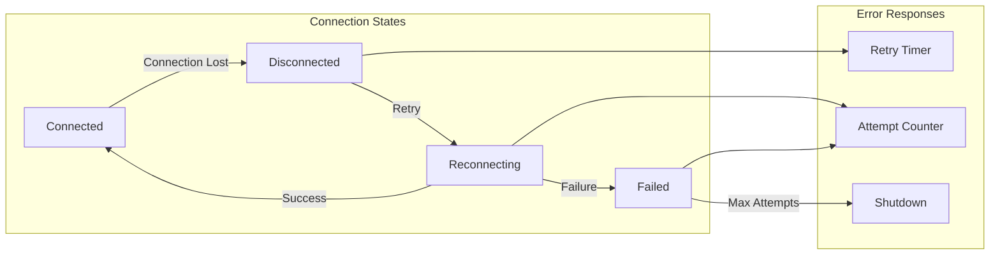

# DDS Agent

The DDS Agent is a core component of the DDS (Dynamic Distributed System) framework responsible for managing user tasks on worker nodes. It provides task execution, shared memory communication, and intercom services for distributed computing environments.

## Table of Contents

- [Overview](#overview)
- [Architecture](#architecture)
- [Shared Memory Transport](#shared-memory-transport)
- [User Task Handling](#user-task-handling)
- [Process Lifecycle](#process-lifecycle)
- [Configuration](#configuration)
- [Error Handling](#error-handling)

## Overview

The DDS Agent acts as a worker node daemon that:

- Connects to the DDS Commander for task coordination
- Manages multiple task execution slots
- Provides shared memory-based inter-process communication
- Handles task lifecycle (assignment, activation, monitoring, termination)
- Forwards messages between user tasks and the DDS network

### Key Components

- **AgentConnectionManager**: Main service coordinator and network management
- **CommanderChannel**: TCP connection to DDS Commander for control messages
- **SMIntercomChannel**: Shared memory channel for user task communication
- **Slot Management**: Isolated execution environments for user tasks

## Architecture



### Threading Model

The agent uses a multi-threaded architecture:

- **Main Threads** (4 threads): Handle network I/O and commander communication
- **Intercom Threads** (6 + NumLeaderFW): Process shared memory messages and user task communication
- **Signal Handler**: Manages graceful shutdown on SIGINT/SIGTERM/SIGQUIT

## Shared Memory Transport

The DDS Agent implements a sophisticated shared memory transport system for high-performance inter-process communication.

### Message Queue Architecture



### Queue Management

The shared memory system uses **boost::interprocess::message_queue** with the following characteristics:

**Queue Types:**

- **Input Queues**: Multiple queues for receiving messages from user tasks
- **Output Queues**: Per-slot queues for sending messages to specific user tasks
- **Message Routing**: Agent forwards messages between network and shared memory

**Queue Naming Convention:**

```cpp
// Input queues (from user tasks to agent)
std::vector<std::string> inputNames = userDefaults.getSMLeaderInputNames();

// Output queues (from agent to specific user task)
std::string outputName = userDefaults.getSMLeaderOutputName(protocolHeaderID);
```

**Message Flow:**

1. User tasks write to input queues
2. Agent reads from all input queues
3. Agent processes and routes messages
4. Agent writes responses to specific output queues
5. User tasks read from their assigned output queue

### Memory Management



**Cleanup Process:**

- Agent removes message queues on shutdown
- Per-slot cleanup removes slot-specific output queues
- Graceful cleanup prevents orphaned shared memory objects

## User Task Handling

The DDS Agent manages user task execution through a sophisticated slot-based system.

### Task Lifecycle



### Slot Information Structure

Each task slot maintains comprehensive metadata:

```cpp
struct SSlotInfo {
    slotId_t m_id;                    // Unique slot identifier
    std::string m_sUsrExe;            // User executable path
    std::string m_sUsrEnv;            // Environment setup script
    taskId_t m_taskID;                // DDS task ID
    uint32_t m_taskIndex;             // Task index in topology
    uint32_t m_collectionIndex;       // Collection index (if applicable)
    std::string m_taskPath;           // Task path in topology
    std::string m_groupName;          // Task group name
    std::string m_collectionName;     // Collection name
    std::string m_taskName;           // Task name
    pid_t m_pid;                      // Process ID of running task
    assets_t m_taskAssets;            // Task-specific file assets
};
```

### Task Assignment Process



### Task Activation Process



### Task Environment Variables

The agent sets up a comprehensive environment for each user task:

| Variable               | Description                              | Example                          |
| ---------------------- | ---------------------------------------- | -------------------------------- |
| `DDS_TASK_ID`          | Unique task identifier                   | `12345`                          |
| `DDS_TASK_INDEX`       | Task index in topology                   | `0, 1, 2, ...`                   |
| `DDS_COLLECTION_INDEX` | Collection index (if part of collection) | `0, 1, 2, ...`                   |
| `DDS_TASK_PATH`        | Full path in topology                    | `/main/group1/collection1/task1` |
| `DDS_GROUP_NAME`       | Task group name                          | `group1`                         |
| `DDS_COLLECTION_NAME`  | Collection name                          | `collection1`                    |
| `DDS_TASK_NAME`        | Task name                                | `task1`                          |
| `DDS_SLOT_ID`          | Slot identifier                          | `1, 2, 3, ...`                   |
| `DDS_SESSION_ID`       | Session identifier                       | `uuid-string`                    |

### File Organization

```
$DDS_USER_HOME/
├── slots/
│   ├── 1/                           # Slot 1 directory
│   │   ├── dds_user_task_wrapper.sh # Generated wrapper script
│   │   ├── user_assets/             # Task-specific files
│   │   └── logs/                    # Task output logs
│   ├── 2/                           # Slot 2 directory
│   └── N/                           # Slot N directory
└── log/
    ├── task1_2024-01-01-12-00-00_12345_out.log
    └── task1_2024-01-01-12-00-00_12345_err.log
```

### Task Wrapper Script

The agent generates a wrapper script for each task execution:

```bash
#!/bin/bash
# Generated by DDS Agent

# Source custom environment (if provided)
source /path/to/custom/environment.sh

# Execute user task
/path/to/user/executable args...
```

## Process Lifecycle

### Task Monitoring



### Graceful Task Termination

The agent implements a sophisticated termination strategy:

1. **SIGTERM Phase** (5 seconds):
   - Send SIGTERM to main process
   - Enumerate all child and grandchild processes
   - Send SIGTERM to all descendants
   - Wait for graceful shutdown

2. **SIGKILL Phase**:
   - If processes still running after timeout
   - Send SIGKILL to all remaining processes
   - Force termination



### Resource Monitoring

The agent continuously monitors system resources:

- **Disk Space**: Prevents task execution when disk space is low
- **Memory Usage**: Tracks task memory consumption
- **Process Status**: Monitors task health and completion
- **Queue Status**: Manages shared memory queue overflow

## Configuration

### Agent Configuration Options

```cpp
struct SOptions_t {
    uint32_t m_slots;           // Number of task slots
    std::string m_groupName;    // Agent group name
    enum ECommand {
        cmd_start,              // Start agent
        cmd_clean              // Clean shared memory
    } m_Command;
};
```

### User Defaults Integration

The agent integrates with DDS User Defaults for:

- Session ID management
- Slot directory configuration
- Shared memory queue naming
- Resource limits and timeouts
- Access permissions for output files

### Server Connection

Agent connects to commander using configuration from server info file:

```ini
[server]
host=localhost
port=20000
```

## Error Handling

### Connection Management



**Reconnection Strategy:**

- Maximum 5 connection attempts
- 5-second delay between attempts
- Exponential backoff for shared memory retries
- Automatic shutdown after maximum failures

### Task Error Handling

| Error Type              | Response                      | Recovery                 |
| ----------------------- | ----------------------------- | ------------------------ |
| Task Assignment Failure | Reply ERROR to commander      | Slot remains available   |
| Task Activation Failure | Reply ERROR to commander      | Clean slot state         |
| Process Spawn Failure   | Reply ERROR to commander      | Reset slot               |
| Task Crash              | Send TASK_DONE with exit code | Auto-cleanup slot        |
| Shared Memory Error     | Log error, retry              | Attempt queue recreation |
| Disk Space Full         | Reject new tasks              | Continue monitoring      |

### Cleanup Procedures

**Normal Shutdown:**

1. Stop accepting new connections
2. Terminate all running tasks gracefully
3. Remove shared memory queues
4. Clean slot directories
5. Remove agent ID file

**Emergency Cleanup:**

1. Force terminate all processes
2. Remove all message queues
3. Clean temporary files
4. Reset shared memory state

---

*This documentation covers the core functionality of the DDS Agent. For implementation details, refer to the source code in the `src/` directory.*
