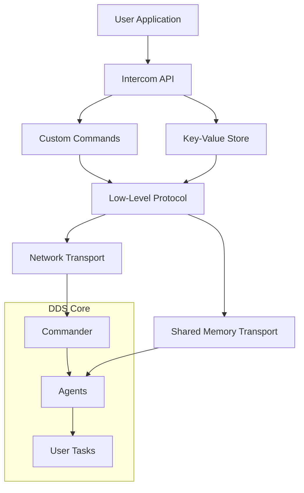
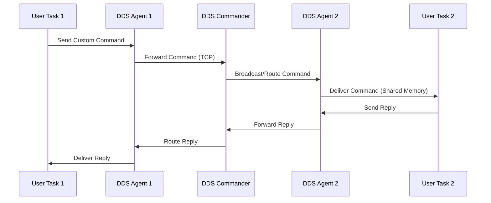
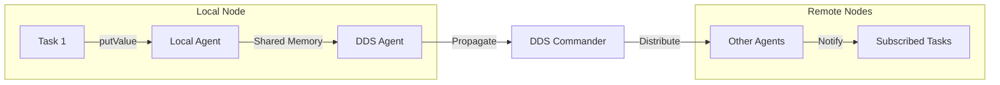

# DDS High-Level Protocol Specification

## Overview

The DDS High-Level Protocol provides application-layer abstractions built on top of the [low-level binary protocol](protocol-low-level.md). It enables distributed task communication, user-defined commands, and property sharing across HPC clusters while maintaining the performance characteristics required for scientific computing workloads.

## Architecture Overview



## Core Components

### 1. Custom Commands

Custom commands enable user-defined communication patterns between distributed tasks. They support conditional execution and provide a flexible messaging system for coordination.

#### Command Structure

```cpp
struct SCustomCmdCmd : public SBasicCmd<SCustomCmdCmd> {
    uint64_t m_timestamp;    // Command creation time (milliseconds since epoch)
    uint64_t m_senderId;     // Unique sender identifier  
    std::string m_sCmd;      // Command string (user-defined)
    std::string m_sCondition; // Execution condition (optional)
};
```

#### Message Flow



#### API Usage

**Sending Commands:**
```cpp
#include "Intercom.h"
using namespace dds::intercom_api;

CIntercomService service;
CCustomCmd customCmd(service);

// Send command to all tasks matching condition
customCmd.send("start_processing", "task_type==worker");

// Send command to specific task
customCmd.send("get_status", "task_id==" + std::to_string(targetId));
```

**Receiving Commands:**
```cpp
// Subscribe to custom commands
customCmd.subscribe([](const std::string& command, 
                      const std::string& condition, 
                      uint64_t senderId) {
    if (command == "start_processing") {
        // Begin processing
        startWorkerThread();
    } else if (command == "get_status") {
        // Reply with status
        customCmd.send("status_ok", std::to_string(senderId));
    }
});
```

#### Conditional Execution

Commands support conditions for selective delivery:

- **Task Type Filtering**: `"task_type==worker"`
- **ID-based Routing**: `"task_id==123"`  
- **Property-based**: `"node_type==compute"`
- **Complex Expressions**: `"cores>=8 && memory>16GB"`

### 2. Key-Value Store

The distributed key-value store enables property sharing and coordination between tasks. It provides eventual consistency with efficient local caching.

#### Key-Value Structure

```cpp
struct SUpdateKeyCmd : public SBasicCmd<SUpdateKeyCmd> {
    std::string m_propertyName;  // Property key
    std::string m_value;         // Property value (string-encoded)
    uint64_t m_senderTaskID;     // Task that set the property
    uint64_t m_receiverTaskID;   // Target task (0 for broadcast)
};
```

#### Data Flow



#### API Usage

**Setting Properties:**
```cpp
CIntercomService service;
CKeyValue keyValue(service);

// Set a property value
keyValue.putValue("experiment_config", "/path/to/config.json");
keyValue.putValue("processing_stage", "initialization");
keyValue.putValue("node_status", "ready");
```

**Monitoring Properties:**
```cpp
// Subscribe to property updates
keyValue.subscribe([](const std::string& key, 
                     const std::string& value, 
                     uint64_t senderTaskId) {
    if (key == "processing_stage") {
        LOG(info) << "Stage changed to: " << value 
                  << " by task: " << senderTaskId;
        
        if (value == "ready_for_processing") {
            beginDataProcessing();
        }
    }
});
```

#### Use Cases

**Configuration Distribution:**
```cpp
// Master task distributes configuration
keyValue.putValue("config_file", configData);
keyValue.putValue("iteration_count", "1000");
keyValue.putValue("output_directory", "/shared/results");
```

**Progress Coordination:**
```cpp
// Workers report completion
keyValue.putValue("worker_" + std::to_string(workerId) + "_status", "completed");

// Master monitors overall progress
keyValue.subscribe([&](const std::string& key, const std::string& value, uint64_t sender) {
    if (key.find("worker_") == 0 && value == "completed") {
        completedWorkers++;
        if (completedWorkers == totalWorkers) {
            keyValue.putValue("job_status", "finished");
        }
    }
});
```

### 3. Intercom Service

The Intercom Service provides the foundational communication layer and manages connections to DDS infrastructure.

#### Service Architecture

```cpp
class CIntercomService {
    std::shared_ptr<CIntercomServiceCore> m_impl;
    
    // Automatic connection management
    void start(const std::string& sessionID);
    void stop();
    
    // Error handling
    void subscribeOnError(errorSignal_t::slot_function_type subscriber);
};
```

#### Connection Management

The service automatically handles:

- **Service Discovery**: Locates DDS commander via configuration files
- **Transport Selection**: Chooses TCP (network) or shared memory (local)
- **Reconnection**: Automatic retry with exponential backoff
- **Session Management**: Maintains connection throughout task lifetime

#### Error Handling

```cpp
service.subscribeOnError([](EErrorCode errorCode, const std::string& errorMsg) {
    switch (errorCode) {
        case EErrorCode::ConnectionFailed:
            LOG(error) << "Failed to connect to DDS: " << errorMsg;
            // Implement fallback behavior
            break;
            
        case EErrorCode::TransportServiceFailed:
            LOG(error) << "Transport service unavailable: " << errorMsg;
            // Graceful degradation
            break;
            
        case EErrorCode::SendKeyValueFailed:
            LOG(error) << "Failed to send key-value: " << errorMsg;
            // Retry or cache for later
            break;
    }
});
```

## RMS Plugin Protocol

For Resource Management System (RMS) integration, DDS provides a specialized protocol for batch system plugins.

### Plugin Communication

```cpp
class CRMSPluginProtocol {
    // Message types for RMS communication
    void onSubmit(signalSubmit_t::slot_function_type subscriber);
    void onMessage(signalMessage_t::slot_function_type subscriber);
    
    // Send responses back to commander
    void sendMessage(EMsgSeverity severity, const std::string& message);
    
    // Lifecycle management
    void start(bool block = true);
    void stop();
};
```

### Message Severity Levels

```cpp
enum class EMsgSeverity {
    info,   // Informational messages
    error   // Error conditions
};
```

### Plugin Implementation Example

```cpp
// SLURM plugin implementation
CRMSPluginProtocol protocol(sessionId);

protocol.onSubmit([](const SSubmit& submit) {
    // Generate SLURM sbatch script
    std::string jobScript = generateSlurmScript(submit);
    
    // Submit to SLURM
    int jobId = submitToSlurm(jobScript);
    
    if (jobId > 0) {
        protocol.sendMessage(EMsgSeverity::info, 
                           "Job submitted with ID: " + std::to_string(jobId));
    } else {
        protocol.sendMessage(EMsgSeverity::error, 
                           "Failed to submit job");
    }
});

protocol.start(true); // Block until completion
```

## Protocol Limits and Constraints

### Custom Command Limits

**Command Structure Constraints:**
- Command string (`m_sCmd`): Limited by string max size (2^16 characters)
- Condition string (`m_sCondition`): Limited by string max size (2^16 characters)  
- Timestamp: 64-bit milliseconds since epoch
- Sender ID: 64-bit identifier

### Key-Value Store Limits

**Property Constraints:**
- Property name: Limited by string max size (2^16 characters)
- Property value: Limited by string max size (2^16 characters)
- Task IDs: 64-bit identifiers (sender and receiver)

**Storage Limitations:**
- No built-in persistence (memory-only storage)
- No automatic expiration or cleanup
- *Future improvement: Add configurable property retention policies*

### Intercom Service Constraints

**Connection Timeouts:**
- Service discovery timeout: Implementation-dependent
- Reconnection attempts: **2 minutes maximum** (hardcoded)
- *Future improvement: Make timeout values configurable*

**Transport Selection:**
- Automatic selection between TCP and shared memory
- No manual transport override option
- Falls back to error reporting if no transport available

### RMS Plugin Protocol Limits

**Message Constraints:**
- Severity levels: `info` and `error` only
- No built-in message size limits beyond underlying protocol
- Session-based communication (requires valid session ID)

**Plugin Lifecycle:**
- Blocking operation with configurable timeout
- No automatic plugin restart capability
- *Future improvement: Add plugin health monitoring*

## Integration Patterns

### Master-Worker Pattern

```cpp
// Master task
void masterTask() {
    CIntercomService service;
    CCustomCmd cmd(service);
    CKeyValue props(service);
    
    // Distribute work configuration
    props.putValue("work_config", serializeConfig(config));
    
    // Signal workers to start
    cmd.send("start_work", "role==worker");
    
    // Monitor progress
    int completedWorkers = 0;
    props.subscribe([&](const std::string& key, const std::string& value, uint64_t sender) {
        if (key.find("worker_result_") == 0) {
            completedWorkers++;
            if (completedWorkers == totalWorkers) {
                cmd.send("shutdown", "role==worker");
            }
        }
    });
    
    service.start();
}

// Worker task  
void workerTask() {
    CIntercomService service;
    CCustomCmd cmd(service);
    CKeyValue props(service);
    
    // Wait for work configuration
    bool workStarted = false;
    props.subscribe([&](const std::string& key, const std::string& value, uint64_t sender) {
        if (key == "work_config" && !workStarted) {
            auto config = deserializeConfig(value);
            processWork(config);
            
            // Report completion
            props.putValue("worker_result_" + std::to_string(getTaskId()), 
                          serializeResults(results));
            workStarted = true;
        }
    });
    
    // Handle commands
    cmd.subscribe([&](const std::string& command, const std::string& condition, uint64_t sender) {
        if (command == "shutdown") {
            service.stop();
        }
    });
    
    service.start();
}
```

### Pipeline Pattern

```cpp
// Pipeline stage implementation
class PipelineStage {
    CIntercomService m_service;
    CKeyValue m_props;
    std::string m_stageName;
    
public:
    PipelineStage(const std::string& stage) : 
        m_props(m_service), m_stageName(stage) {
        
        // Monitor input from previous stage
        m_props.subscribe([this](const std::string& key, const std::string& value, uint64_t sender) {
            std::string inputKey = m_stageName + "_input";
            if (key == inputKey) {
                // Process data and forward to next stage
                auto result = processData(value);
                
                std::string outputKey = getNextStage() + "_input";
                m_props.putValue(outputKey, result);
            }
        });
    }
    
    void start() { m_service.start(); }
};
```

### Event-Driven Processing

```cpp
// Event-driven task coordination
class EventProcessor {
    CIntercomService m_service;
    CCustomCmd m_cmd;
    CKeyValue m_props;
    
public:
    EventProcessor() : m_cmd(m_service), m_props(m_service) {
        setupEventHandlers();
    }
    
private:
    void setupEventHandlers() {
        // Handle external events
        m_cmd.subscribe([this](const std::string& cmd, const std::string& condition, uint64_t sender) {
            if (cmd == "data_available") {
                processNewData();
            } else if (cmd == "config_updated") {
                reloadConfiguration();
            }
        });
        
        // Monitor system state
        m_props.subscribe([this](const std::string& key, const std::string& value, uint64_t sender) {
            if (key == "system_load" && std::stof(value) > 0.8) {
                // Throttle processing
                m_cmd.send("reduce_load", "role==processor");
            }
        });
    }
};
```

## Best Practices

### Performance Optimization

1. **Minimize Property Updates**: Batch related updates when possible
2. **Use Conditions**: Target specific tasks to reduce unnecessary traffic
3. **Cache Locally**: Store frequently accessed properties in task memory
4. **Monitor Memory**: Set limits on property retention and command history

### Error Handling

1. **Subscribe to Errors**: Always monitor service error events
2. **Implement Timeouts**: Don't wait indefinitely for responses
3. **Graceful Degradation**: Continue operation when possible during communication failures
4. **Retry Logic**: Implement exponential backoff for transient failures

### Security Considerations

1. **Input Validation**: Validate all received commands and property values
2. **Resource Limits**: Prevent excessive memory usage from malicious inputs
3. **Network Security**: Use VPN/firewalls for untrusted network environments
4. **Access Control**: Implement application-level authorization if needed

### Debugging and Monitoring

1. **Enable Logging**: Use DDS logging framework for troubleshooting
2. **Monitor Metrics**: Track message rates, latency, and error frequencies
3. **Health Checks**: Implement periodic connectivity tests
4. **Trace Events**: Log key state transitions for debugging

## Integration with External Systems

### Message Queue Integration

```cpp
// Bridge to external message systems
class MessageBridge {
    CIntercomService m_ddsService;
    CCustomCmd m_ddsCmd;
    ExternalMQ m_externalMQ;
    
public:
    void bridgeMessages() {
        // DDS → External
        m_ddsCmd.subscribe([this](const std::string& cmd, const std::string& condition, uint64_t sender) {
            if (cmd.find("external_") == 0) {
                m_externalMQ.publish(cmd.substr(9), condition);
            }
        });
        
        // External → DDS
        m_externalMQ.subscribe([this](const std::string& topic, const std::string& data) {
            m_ddsCmd.send("external_" + topic, data);
        });
    }
};
```

### Database Integration

```cpp
// Persistent property storage
class PropertyPersistence {
    CKeyValue m_props;
    DatabaseConnection m_db;
    
public:
    PropertyPersistence(CIntercomService& service) : m_props(service) {
        // Persist important properties
        m_props.subscribe([this](const std::string& key, const std::string& value, uint64_t sender) {
            if (key.find("persistent_") == 0) {
                m_db.execute("INSERT INTO properties VALUES (?, ?, ?)", 
                           key, value, getCurrentTimestamp());
            }
        });
    }
};
```

## Migration Guide

### From Direct Socket Communication

```cpp
// Old approach - direct sockets
void oldCommunication() {
    Socket socket;
    socket.connect("worker-node:1234");
    socket.send("start_processing");
    std::string response = socket.receive();
}

// New approach - DDS high-level protocol
void newCommunication() {
    CIntercomService service;
    CCustomCmd cmd(service);
    
    cmd.send("start_processing", "node==worker-node");
    cmd.subscribeOnReply([](const std::string& reply) {
        // Handle response
    });
    
    service.start();
}
```

### From File-Based Coordination

```cpp
// Old approach - shared files
void oldCoordination() {
    // Write status file
    std::ofstream status("status.txt");
    status << "processing_complete" << std::endl;
    
    // Poll for other files
    while (!fileExists("all_done.flag")) {
        sleep(1);
    }
}

// New approach - key-value store
void newCoordination() {
    CIntercomService service;
    CKeyValue props(service);
    
    // Set status
    props.putValue("processing_status", "complete");
    
    // Wait for coordination signal
    props.subscribe([](const std::string& key, const std::string& value, uint64_t sender) {
        if (key == "all_done" && value == "true") {
            proceedToNextStage();
        }
    });
    
    service.start();
}
```

---

*This specification covers the high-level protocol features of DDS. For underlying transport and serialization details, see [Low-Level Protocol Documentation](protocol-low-level.md).*
