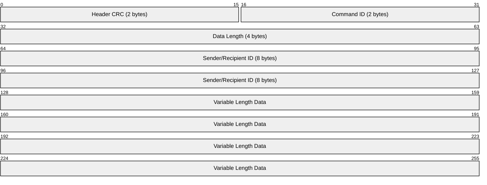

# DDS Low-Level Protocol Specification

## Overview

The Dynamic Deployment System (DDS) implements a lightweight, efficient binary protocol designed for high-performance computing environments. The protocol prioritizes speed, minimal overhead, and reliable communication between DDS components across both network and local shared memory transports.

## Design Goals

- **Efficiency**: Minimal serialization overhead with binary encoding
- **Reliability**: CRC validation and structured error handling  
- **Scalability**: Async I/O with boost::asio for thousands of concurrent connections
- **Flexibility**: Dual transport support (TCP + shared memory)
- **Performance**: Optimized for HPC workloads with low latency requirements

## Protocol Architecture

The DDS protocol operates at two distinct layers:

1. **Transport Layer**: Raw binary message framing and delivery
2. **Command Layer**: Structured commands with typed payloads

## Binary Message Format

### Packet Structure



### Header Layout

The protocol uses a fixed 16-byte header followed by variable-length data:

| Offset | Size | Field | Description                                                   |
| ------ | ---- | ----- | ------------------------------------------------------------- |
| 0      | 2    | CRC   | CRC-16 checksum of header (excluding CRC field)               |
| 2      | 2    | CMD   | Command type identifier (see [Command Types](#command-types)) |
| 4      | 4    | LEN   | Length of data section in bytes                               |
| 8      | 8    | ID    | Sender ID (to commander) or Recipient ID (from commander)     |

### Data Encoding

All multi-byte integers use **network byte order (big-endian)** for cross-platform compatibility.

**Header Validation:**

```cpp
bool SMessageHeader::isValid() const {
    return (getChecksum() == m_crc);
}
```

The CRC-16 checksum covers bytes 2-15 of the header (excluding the CRC field itself).

## Command Types

The protocol defines 40+ command types organized by functionality, including core commands, replies, and specialized operations.

### Core Commands

- `cmdUNKNOWN` - Unknown command type
- `cmdRAW_MSG` - Raw message processing
- `cmdSHUTDOWN` - Graceful connection termination
- `cmdHANDSHAKE` - Initial connection negotiation
- `cmdREPLY_HANDSHAKE_OK` - Successful handshake response
- `cmdREPLY_HANDSHAKE_ERR` - Handshake error response
- `cmdREPLY` - Generic response message

### Task Management

- `cmdSUBMIT` - Submit job/task
- `cmdASSIGN_USER_TASK` - Assign task to agent
- `cmdACTIVATE_USER_TASK` - Start assigned task
- `cmdSTOP_USER_TASK` - Stop running task
- `cmdUSER_TASK_DONE` - Task completion notification

### Communication & Messaging

- `cmdSIMPLE_MSG` - Text messages with severity levels
- `cmdCUSTOM_CMD` - User-defined commands
- `cmdUPDATE_KEY` - Key-value store updates

### Information Exchange

- `cmdGET_HOST_INFO` - Request host information
- `cmdREPLY_HOST_INFO` - Host information response
- `cmdGET_AGENTS_INFO` - Request agent status
- `cmdREPLY_AGENTS_INFO` - Agent status response
- `cmdGET_PROP_LIST` - Request property list
- `cmdGET_PROP_VALUES` - Request property values
- `cmdGET_LOG` - Request log information
- `cmdGET_ID` - Request ID information
- `cmdREPLY_ID` - ID information response
- `cmdGED_PID` - Get process ID
- `cmdREPLY_PID` - Process ID response
- `cmdGET_IDLE_AGENTS_COUNT` - Request idle agent count
- `cmdREPLY_IDLE_AGENTS_COUNT` - Idle agent count response

### ID & Session Management

- `cmdSET_ID` - Set ID information
- `cmdADD_SLOT` - Add slot
- `cmdREPLY_ADD_SLOT` - Add slot response
- `cmdLOBBY_MEMBER_INFO` - Lobby member information
- `cmdLOBBY_MEMBER_HANDSHAKE` - Lobby member handshake

### Binary Data Transfer

- `cmdBINARY_ATTACHMENT_START` - Begin binary transfer
- `cmdBINARY_ATTACHMENT` - Binary data chunk
- `cmdBINARY_ATTACHMENT_RECEIVED` - Transfer acknowledgment

### Topology Management

- `cmdSET_TOPOLOGY` - Set topology configuration
- `cmdUPDATE_TOPOLOGY` - Update topology

### System & Monitoring

- `cmdTRANSPORT_TEST` - Transport layer testing
- `cmdPROGRESS` - Progress reporting
- `cmdWATCHDOG_HEARTBEAT` - Heartbeat monitoring

**Protocol Version:** Current version is 5 (defined in `g_protocolCommandsVersion`)

## Data Serialization

### Primitive Types

The protocol provides efficient serialization for basic data types:

| Type                 | Size        | Encoding                              |
| -------------------- | ----------- | ------------------------------------- |
| `uint8_t`            | 1 byte      | Direct binary                         |
| `uint16_t`           | 2 bytes     | Network byte order                    |
| `uint32_t`           | 4 bytes     | Network byte order                    |
| `uint64_t`           | 8 bytes     | Network byte order                    |
| `std::string`        | 2 + N bytes | Length prefix (uint16_t) + UTF-8 data |
| `boost::uuids::uuid` | 16 bytes    | Raw binary UUID                       |

### Container Types

**Vector Serialization:**

- All vectors (except `uint8_t`) have max size of 2^16 elements
- `std::vector<uint8_t>` has max size of 2^32 bytes  
- Format: size prefix + serialized elements

```cpp
template<>
size_t dsize<std::vector<uint32_t>>(const std::vector<uint32_t>& _value) {
    return _value.size() * sizeof(uint32_t) + sizeof(uint16_t);
}
```

**String Vectors:**
```cpp
template<>
size_t dsize<std::vector<std::string>>(const std::vector<std::string>& _value) {
    size_t sum(sizeof(uint16_t));
    for (const auto& v : _value)
        sum += (v.size() + sizeof(uint16_t));
    return sum;
}
```

### Command Serialization

Commands inherit from `SBasicCmd<T>` and implement:

```cpp
struct SExampleCmd : public SBasicCmd<SExampleCmd> {
    size_t size() const;
    void _convertFromData(const dds::misc::BYTEVector_t& _data);
    void _convertToData(dds::misc::BYTEVector_t* _data) const;
    
    // Command data members
    uint64_t m_timestamp;
    std::string m_message;
};
```

## Transport Layer

### Network Transport (TCP)

**Features:**

- Boost::asio async I/O for high concurrency
- Connection pooling and reuse
- Automatic reconnection with exponential backoff
- Message accumulation to reduce system calls

**Connection Management:**

```cpp
class CBaseChannelImpl {
    boost::asio::ip::tcp::socket m_socket;
    boost::asio::io_context& m_ioContext;
    
    void readHeader();
    void readMessage();
    void writeMessage();
};
```

**Performance Optimizations:**

- Accumulative message sending (batches small messages)
- Deadline timers to prevent excessive batching
- Write queue management for flow control

### Shared Memory Transport

**Features:**

- Zero-copy for local process communication
- Boost::interprocess message queues
- Multiple input/output channels per process
- Automatic cleanup on process termination

**Message Queue Configuration:**

- Max messages: Configurable per queue
- Max message size: Supports large binary payloads
- Open modes: `OpenOrCreate`, `CreateOnly`, `OpenOnly`

```cpp
class CBaseSMChannelImpl {
    messageQueuePtr_t createMessageQueue(const std::string& _name, EMQOpenType _openType);
    void writeMessage(const SMessageOutputBuffer::Ptr_t& _buffer);
    void readMessage(const SMessageQueueInfo& _info);
};
```

## Protocol Limits and Constraints

### Message Size Limits

**Container Size Restrictions:**

- All vectors (except `uint8_t`) have max size of 2^16 (65,536) elements
- `std::vector<uint8_t>` has max size of 2^32 (4,294,967,296) bytes  
- `std::string` has max size of 2^16 (65,536) characters

**Shared Memory Message Queue:**

- Max message size: **512KB** (hardcoded in `BaseSMChannelImpl.h`)
- Note: Reduced from 65KB to 2KB due to performance problems (see code comment)
- *Future improvement: Make message size configurable*

### Queue and Buffer Limits

**Message Accumulation Queue:**

- Max accumulative write queue size: **10,000 messages** (hardcoded in `BaseChannelImpl.h`)
- Deadline timer for batching: **10ms** (hardcoded)
- *Future improvement: Make queue sizes and timing configurable*

**Message Queue Configuration:**

- Max number of messages per queue: Configurable per message queue
- Open modes: `OpenOrCreate`, `CreateOnly`, `OpenOnly`

### Connection Limits

**Reconnection Parameters:**

- Max reconnection timeout: **2 minutes** (mentioned in error handling)
- *Future improvement: Make reconnection parameters configurable*

### Transport Constraints

**Binary Transfer Testing:**

- Transport test supports transfers up to **10MB** (see `ConnectionManager.cpp`)
- Test sizes: 1KB, 10KB, 100KB, 1MB, 10MB in binary attachments

**Protocol Version:**

- Current version: **5** (defined in `g_protocolCommandsVersion`)
- Breaking changes require version increment
- No backward compatibility currently implemented

## Error Handling

### Connection Errors

- Automatic retry with exponential backoff (2-minute timeout)
- Error codes: `ConnectionFailed`, `TransportServiceFailed`
- Graceful degradation when services unavailable

### Protocol Errors

- CRC validation detects corrupted messages
- Length validation prevents buffer overflows
- Command validation ensures proper message types

### Error Reporting

```cpp
enum class EErrorCode {
    SendKeyValueFailed,
    ConnectionFailed, 
    TransportServiceFailed
};
```

## Implementation Notes

### Thread Safety

- Message queues protected by mutexes
- Async operations use shared_ptr for lifetime management
- Signal/slot pattern for event handling

### Memory Management

- RAII patterns throughout codebase
- Shared ownership with std::shared_ptr
- Automatic cleanup of shared memory resources

### Cross-Platform Compatibility

- Network byte order for endianness
- Boost libraries for portable implementation
- Tested on Linux, macOS, and Windows

## Usage Examples

### Basic Message Sending

```cpp
// Create protocol message
SSimpleMsgCmd cmd("Hello World", dds::misc::info);
auto msg = SCommandAttachmentImpl<cmdSIMPLE_MSG>::encode(cmd, protocolID);

// Send via network channel
channel->pushMsg<cmdSIMPLE_MSG>(cmd, protocolID);

// Send via shared memory
smChannel->pushMsg<cmdSIMPLE_MSG>(cmd, protocolID, outputID);
```

### Binary Data Transfer

```cpp
// Large binary data
std::vector<uint8_t> data(1024 * 1024); // 1MB
std::string filename = "large_file.bin";

// Send with chunking for large files
channel->pushBinaryAttachmentCmd(data, filename, cmdBINARY_ATTACHMENT);
```

### Custom Command Implementation

```cpp
struct SMyCustomCmd : public SBasicCmd<SMyCustomCmd> {
    uint64_t m_userId;
    std::string m_action;
    std::vector<uint32_t> m_parameters;
    
    size_t size() const {
        return dsize(m_userId) + dsize(m_action) + dsize(m_parameters);
    }
    
    void _convertToData(dds::misc::BYTEVector_t* _data) const {
        SAttachmentDataProvider(*_data)
            .put(m_userId)
            .put(m_action) 
            .put(m_parameters);
    }
    
    void _convertFromData(const dds::misc::BYTEVector_t& _data) {
        SAttachmentDataProvider(_data)
            .get(m_userId)
            .get(m_action)
            .get(m_parameters);
    }
};
```

## Security Considerations

- **No encryption**: Protocol assumes trusted network environment
- **CRC validation**: Detects accidental corruption but not malicious tampering
- **No authentication**: Relies on network-level security
- **Input validation**: Length checks prevent basic buffer overflow attacks

For production HPC environments, consider:

- Network isolation/VPNs for untrusted networks
- Application-level authentication if required
- Monitoring for unusual traffic patterns

## Debugging and Monitoring

### Logging

- Extensive debug logging throughout protocol stack
- Message hex dumps for troubleshooting
- Connection lifecycle tracking

### Monitoring Tools

- Built-in transport testing commands
- Connection statistics and health checks
- Message queue status monitoring

---

*This specification covers DDS protocol. For high-level protocol features like custom commands and key-value operations, see [High-Level Protocol Documentation](protocol-high-level.md).*
