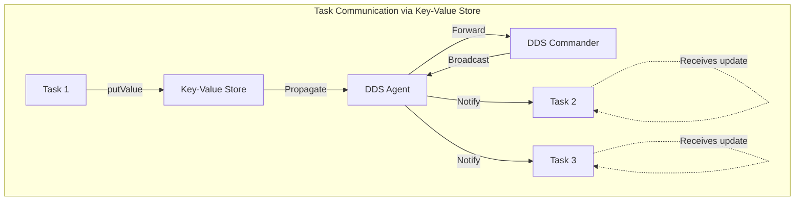
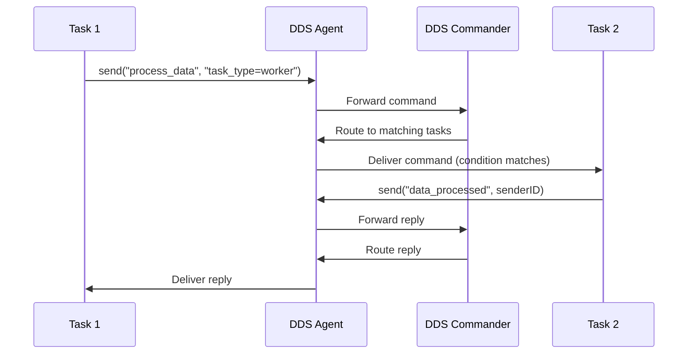
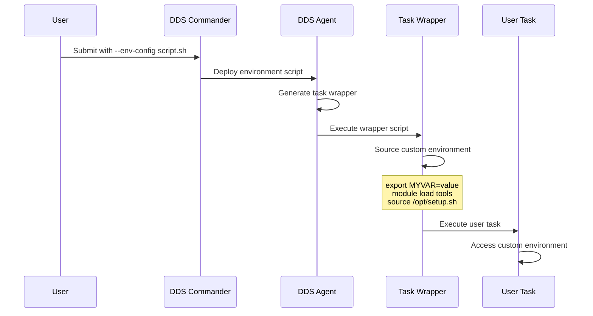
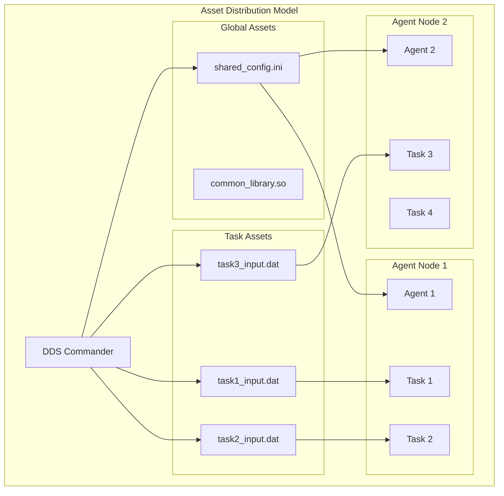
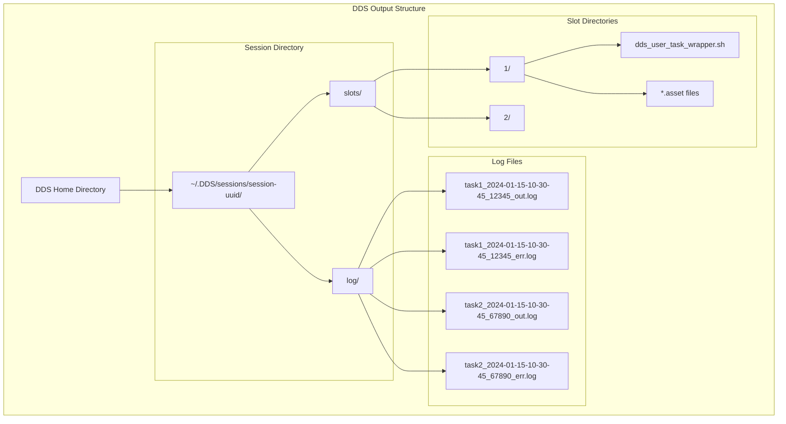

# DDS User Task Guide

This guide provides comprehensive information for users developing and deploying tasks in the DDS (Dynamic Distributed System) framework. Learn how to leverage DDS's environment variables, communication APIs, custom environments, and file management features to build efficient distributed applications.

## Table of Contents

- [Overview](#overview)
- [Environment Variables](#environment-variables)
- [Task Communication](#task-communication)
- [Custom Environments](#custom-environments)
- [File Assets](#file-assets)
- [Output Management](#output-management)
- [Best Practices](#best-practices)
- [Examples](#examples)

## Overview

DDS user tasks are programs executed in a distributed environment with automatic resource management, inter-task communication, and environment setup. Each task runs in an isolated slot with dedicated resources and communication channels.

### Key Features Available to User Tasks

- **Rich Environment Variables**: Task metadata, topology information, and session context
- **Key-Value Store**: Distributed property sharing between tasks
- **Custom Commands**: Request-response communication patterns
- **File Assets**: Automatic file distribution and management
- **Custom Environments**: User-defined environment setup scripts
- **Output Capture**: Automatic stdout/stderr logging with configurable permissions

## Environment Variables

DDS automatically provides a comprehensive set of environment variables for each task, enabling tasks to understand their context and coordinate with other components.

### Core Task Variables

These variables provide essential task identification and topology information:

| Variable         | Description                    | Example Value                    | Use Case                                  |
| ---------------- | ------------------------------ | -------------------------------- | ----------------------------------------- |
| `DDS_TASK_ID`    | Unique task identifier         | `12345678901234567890`           | Task identification in logs/communication |
| `DDS_TASK_INDEX` | Zero-based task instance index | `0`, `1`, `2`, ...               | Array-like task coordination              |
| `DDS_TASK_NAME`  | Task name from topology        | `worker_task`                    | Task type identification                  |
| `DDS_TASK_PATH`  | Full topology path             | `/main/group1/collection1/task1` | Hierarchical task location                |

### Topology Context Variables

These variables help tasks understand their position in the topology hierarchy:

| Variable               | Description                          | Example Value      | Use Case                           |
| ---------------------- | ------------------------------------ | ------------------ | ---------------------------------- |
| `DDS_GROUP_NAME`       | Parent group name                    | `workers`          | Group-based coordination           |
| `DDS_COLLECTION_NAME`  | Parent collection name               | `data_processors`  | Collection-based operations        |
| `DDS_COLLECTION_INDEX` | Zero-based collection instance index | `0`, `1`, `2`, ... | Collection instance identification |

### System Context Variables

These variables provide system-level information:

| Variable         | Description                | Example Value                          | Use Case                   |
| ---------------- | -------------------------- | -------------------------------------- | -------------------------- |
| `DDS_SESSION_ID` | DDS session identifier     | `12345678-1234-1234-1234-123456789abc` | Session-specific resources |
| `DDS_SLOT_ID`    | Agent slot identifier      | `1`, `2`, `3`, ...                     | Slot-specific operations   |
| `DDS_LOCATION`   | DDS installation directory | `/opt/dds`                             | DDS binary/library access  |

### Using Environment Variables in Your Code

#### C++ Example

```cpp
#include "EnvProp.h"
#include <iostream>
#include <string>

using namespace dds;

int main() {
    // Access variables using DDS helper functions
    uint64_t taskID = env_prop<EEnvProp::task_id>();
    size_t taskIndex = env_prop<EEnvProp::task_index>();
    std::string taskName = env_prop<EEnvProp::task_name>();
    std::string taskPath = env_prop<EEnvProp::task_path>();
    
    std::cout << "Task ID: " << taskID << std::endl;
    std::cout << "Task Index: " << taskIndex << std::endl;
    std::cout << "Task Name: " << taskName << std::endl;
    std::cout << "Task Path: " << taskPath << std::endl;
    
    return 0;
}
```

#### Python Example

```python
import os

def get_task_info():
    """Extract DDS task information from environment."""
    return {
        'task_id': os.environ.get('DDS_TASK_ID'),
        'task_index': int(os.environ.get('DDS_TASK_INDEX', 0)),
        'task_name': os.environ.get('DDS_TASK_NAME'),
        'task_path': os.environ.get('DDS_TASK_PATH'),
        'group_name': os.environ.get('DDS_GROUP_NAME'),
        'collection_name': os.environ.get('DDS_COLLECTION_NAME'),
        'collection_index': int(os.environ.get('DDS_COLLECTION_INDEX', 0)),
        'slot_id': int(os.environ.get('DDS_SLOT_ID', 0)),
        'session_id': os.environ.get('DDS_SESSION_ID')
    }

if __name__ == "__main__":
    info = get_task_info()
    print(f"Running task {info['task_name']} (index {info['task_index']})")
    print(f"Located at: {info['task_path']}")
```

## Task Communication

DDS provides two primary communication mechanisms for user tasks: **Key-Value Store** for distributed property sharing and **Custom Commands** for request-response patterns.

### Key-Value Store

The key-value store enables tasks to share named properties across the distributed system with automatic propagation and notification.

#### Key-Value Communication Flow



#### C++ Key-Value Example

```cpp
#include "Intercom.h"
#include <iostream>
#include <condition_variable>
#include <mutex>

using namespace dds::intercom_api;

int main() {
    std::mutex keyMutex;
    std::condition_variable keyCondition;
    
    // Initialize DDS intercom service
    CIntercomService service;
    CKeyValue keyValue(service);
    
    // Subscribe to error events
    service.subscribeOnError([](EErrorCode errorCode, const std::string& msg) {
        std::cerr << "DDS Error " << errorCode << ": " << msg << std::endl;
    });
    
    // Subscribe to key-value updates
    keyValue.subscribe([&](const std::string& propertyName, 
                          const std::string& value, 
                          uint64_t senderTaskID) {
        std::cout << "Received update: " << propertyName 
                  << " = " << value 
                  << " from task " << senderTaskID << std::endl;
        keyCondition.notify_all();
    });
    
    // Start the service
    service.start();
    
    // Put a value
    keyValue.putValue("my_property", "my_value");
    
    // Wait for updates from other tasks
    std::unique_lock<std::mutex> lock(keyMutex);
    keyCondition.wait(lock);
    
    return 0;
}
```

#### Key-Value Usage Patterns

**1. Configuration Distribution:**

```cpp
// Leader task distributes configuration
if (taskIndex == 0) {
    keyValue.putValue("input_file", "/data/input.txt");
    keyValue.putValue("num_iterations", "1000");
    keyValue.putValue("output_format", "json");
}
```

**2. Progress Reporting:**

```cpp
// Tasks report completion status
std::string progressKey = "progress_" + std::to_string(taskIndex);
keyValue.putValue(progressKey, "completed");
```

**3. Result Aggregation:**

```cpp
// Tasks share partial results
std::string resultKey = "result_" + std::to_string(taskIndex);
keyValue.putValue(resultKey, std::to_string(myResult));
```

### Custom Commands

Custom commands provide request-response communication with condition-based routing and reply mechanisms.

#### Custom Command Communication Flow



#### C++ Custom Command Example

```cpp
#include "Intercom.h"
#include <iostream>

using namespace dds::intercom_api;

int main() {
    CIntercomService service;
    CCustomCmd customCmd(service);
    
    // Subscribe to error events
    service.subscribeOnError([](EErrorCode errorCode, const std::string& msg) {
        std::cerr << "DDS Error " << errorCode << ": " << msg << std::endl;
    });
    
    // Subscribe to custom commands
    customCmd.subscribe([&](const std::string& command, 
                           const std::string& condition, 
                           uint64_t senderID) {
        std::cout << "Received command: " << command 
                  << " condition: " << condition 
                  << " from: " << senderID << std::endl;
                  
        // Process the command and send reply
        if (command == "process_data") {
            // Do some work...
            std::string reply = "data_processed_by_" + std::to_string(getTaskID());
            customCmd.send(reply, std::to_string(senderID));
        }
    });
    
    // Subscribe to replies
    customCmd.subscribeOnReply([](const std::string& reply) {
        std::cout << "Received reply: " << reply << std::endl;
    });
    
    // Start the service
    service.start();
    
    // Send a command to worker tasks
    customCmd.send("process_data", "task_type=worker");
    
    // Keep running to receive replies
    std::this_thread::sleep_for(std::chrono::seconds(30));
    
    return 0;
}
```

#### Command Targeting Strategies

**1. Broadcast to All:**

```cpp
customCmd.send("shutdown", "");  // Empty condition targets all tasks
```

**2. Target Specific Task Type:**

```cpp
customCmd.send("start_processing", "task_name=worker");
```

**3. Target by Index Range:**

```cpp
customCmd.send("special_task", "task_index<10");
```

**4. Target by Group/Collection:**

```cpp
customCmd.send("coordinate", "group_name=data_processors");
```

## Custom Environments

DDS supports custom environment setup for tasks through user-defined environment scripts that are executed before task startup.

### Environment Script Workflow



### Creating Custom Environment Scripts

#### Environment Script Template

```bash
#!/bin/bash
# Custom DDS environment script

# Set custom environment variables
export MY_APP_CONFIG="/path/to/config"
export DATA_ROOT="/shared/data"
export NUM_THREADS=4

# Load environment modules (if using module system)
if command -v module >/dev/null 2>&1; then
    module load gcc/9.3.0
    module load openmpi/4.0.3
    module load python/3.8.5
fi

# Add custom paths
export PATH="/opt/mytools/bin:$PATH"
export LD_LIBRARY_PATH="/opt/mytools/lib:$LD_LIBRARY_PATH"

# Source site-specific setup
if [ -f "/etc/site-setup.sh" ]; then
    source /etc/site-setup.sh
fi

# Task-specific customization based on DDS variables
if [ "$DDS_TASK_NAME" = "master_task" ]; then
    export ROLE="master"
    export LOG_LEVEL="debug"
else
    export ROLE="worker" 
    export LOG_LEVEL="info"
fi

# Collection-specific settings
case "$DDS_COLLECTION_NAME" in
    "data_processors")
        export WORKER_TYPE="data_processing"
        export MEMORY_LIMIT="8GB"
        ;;
    "io_handlers")
        export WORKER_TYPE="io_handling"
        export MEMORY_LIMIT="2GB"
        ;;
esac

echo "Custom environment loaded for task $DDS_TASK_NAME (index $DDS_TASK_INDEX)"
```

### Deployment Methods

#### Method 1: Submit Command Line

```bash
# Deploy with environment script
dds-submit --rms localhost --env-config my_environment.sh

# Or for SSH plugin with inline environment
dds-submit --rms ssh --config ssh_config_with_inline_env.cfg
```

#### Method 2: SSH Plugin Inline Configuration

The SSH plugin supports embedding bash scripts directly in the configuration file using special tags:

```properties
@bash_begin@
# Custom environment for SSH workers
export DATA_PATH=/local/data
module load python/3.8

# Task-specific customization based on DDS variables
if [ "$DDS_TASK_NAME" = "master_task" ]; then
    export ROLE="master"
else
    export ROLE="worker"
fi
@bash_end@

# SSH worker definitions
wn1, user@worker1.example.com, -p22, /home/user/dds_work, 4
wn2, user@worker2.example.com, -p22, /home/user/dds_work, 4
```

For more details, see the [SSH Plugin Documentation](../plugins/dds-submit-ssh/README.md#inline-environment-scripts).

#### Method 3: Global User Environment

Create `~/.DDS/user_worker_env.sh` for automatic inclusion:

```bash
#!/bin/bash
# Global user environment for all DDS sessions
export DEFAULT_DATA_ROOT="/home/user/data"
export DEFAULT_OUTPUT_DIR="/home/user/results"
```

### Path Placeholders

DDS provides automatic path placeholder replacement in environment scripts:

| Placeholder               | Description            | Replaced With              |
| ------------------------- | ---------------------- | -------------------------- |
| `%DDS_DEFAULT_TASK_PATH%` | Task slot directory    | `/home/user/.DDS/slots/1/` |
| `%taskIndex%`             | Task index value       | `0`, `1`, `2`, ...         |
| `%collectionIndex%`       | Collection index value | `0`, `1`, `2`, ...         |

#### Example with Placeholders

```bash
#!/bin/bash
# Environment script with placeholders

# Task-specific directories
export TASK_WORK_DIR="%DDS_DEFAULT_TASK_PATH%/work"
export TASK_OUTPUT_DIR="%DDS_DEFAULT_TASK_PATH%/output"

# Index-based configuration
export CONFIG_FILE="/configs/config_%taskIndex%.ini"
export LOG_FILE="/logs/task_%taskIndex%.log"

# Collection-specific settings
if [ "%collectionIndex%" != "" ]; then
    export COLLECTION_DATA="/data/collection_%collectionIndex%"
fi

# Create directories
mkdir -p "$TASK_WORK_DIR" "$TASK_OUTPUT_DIR"
```

## File Assets

DDS assets enable automatic distribution of files and data to compute nodes, with support for task-specific and global scoped assets.

### Asset Types and Scoping



### Asset Declaration in Topology

#### XML Topology Example

```xml
<?xml version="1.0" encoding="UTF-8"?>
<topology name="asset_example">
    
    <!-- Global assets - shared across all tasks in session -->
    <asset name="shared_config" type="inline" visibility="global" 
           value="database_url=postgresql://localhost:5432/mydb&#10;timeout=30&#10;retries=3"/>
    
    <asset name="common_script" type="inline" visibility="global" 
           value="#!/bin/bash&#10;export SHARED_LIB_PATH=/opt/shared&#10;echo 'Common setup complete'"/>
    
    <!-- Task-specific assets - unique per task instance -->
    <asset name="task_config" type="inline" visibility="task" 
           value="task_id=%taskIndex%&#10;input_file=/data/input_%taskIndex%.txt&#10;output_file=/data/output_%taskIndex%.txt"/>
    
    <declgroup name="workers">
        <decltask name="worker_task">
            <exe>./my_worker --config=task_config.asset --shared=shared_config.asset</exe>
            <assets>
                <name>shared_config</name>
                <name>common_script</name>
                <name>task_config</name>
            </assets>
        </decltask>
        
        <declcollection name="data_processors">
            <decltask name="processor">
                <exe>./data_processor --input=task_config.asset</exe>
                <assets>
                    <name>task_config</name>
                </assets>
            </decltask>
        </declcollection>
    </declgroup>
    
    <main name="main">
        <group name="workers" n="4"/>
        <collection name="data_processors" n="8"/>
    </main>
    
</topology>
```

### Using Assets in Tasks

#### Accessing Asset Files

Assets are made available as files with `.asset` extension in the task's working directory:

```cpp
// C++ example reading asset file
#include <fstream>
#include <iostream>
#include <string>

int main() {
    // Read configuration from global asset
    std::ifstream configFile("shared_config.asset");
    if (configFile.is_open()) {
        std::string line;
        while (std::getline(configFile, line)) {
            std::cout << "Config: " << line << std::endl;
            // Parse configuration...
        }
        configFile.close();
    }
    
    // Read task-specific asset
    std::ifstream taskConfigFile("task_config.asset");
    if (taskConfigFile.is_open()) {
        std::string line;
        while (std::getline(taskConfigFile, line)) {
            std::cout << "Task Config: " << line << std::endl;
        }
        taskConfigFile.close();
    }
    
    return 0;
}
```

#### Shell Script Asset Usage

```bash
#!/bin/bash

echo "Task starting with assets:"

# Source executable asset as script
if [ -f "common_script.asset" ]; then
    echo "Sourcing common setup script..."
    source common_script.asset
fi

# Read configuration asset
if [ -f "shared_config.asset" ]; then
    echo "Reading shared configuration:"
    cat shared_config.asset
    
    # Parse configuration (example)
    DATABASE_URL=$(grep "database_url=" shared_config.asset | cut -d'=' -f2)
    echo "Database URL: $DATABASE_URL"
fi

# Process task-specific configuration
if [ -f "task_config.asset" ]; then
    echo "Reading task configuration:"
    cat task_config.asset
    
    INPUT_FILE=$(grep "input_file=" task_config.asset | cut -d'=' -f2)
    OUTPUT_FILE=$(grep "output_file=" task_config.asset | cut -d'=' -f2)
    
    echo "Processing $INPUT_FILE -> $OUTPUT_FILE"
fi
```

#### Python Asset Processing

```python
import os
import configparser

def load_assets():
    """Load DDS assets into configuration."""
    config = {}
    
    # Load global shared configuration
    if os.path.exists('shared_config.asset'):
        with open('shared_config.asset', 'r') as f:
            for line in f:
                line = line.strip()
                if '=' in line:
                    key, value = line.split('=', 1)
                    config[key] = value
    
    # Load task-specific configuration
    task_config = {}
    if os.path.exists('task_config.asset'):
        with open('task_config.asset', 'r') as f:
            for line in f:
                line = line.strip()
                if '=' in line:
                    key, value = line.split('=', 1)
                    task_config[key] = value
    
    return config, task_config

if __name__ == "__main__":
    shared_config, task_config = load_assets()
    
    print(f"Shared config: {shared_config}")
    print(f"Task config: {task_config}")
    
    # Use configuration
    if 'input_file' in task_config:
        input_file = task_config['input_file']
        print(f"Processing input file: {input_file}")
```

### Asset Best Practices

#### 1. Configuration Management

```xml
<!-- Separate configuration concerns -->
<asset name="database_config" type="inline" visibility="global" 
       value="host=db.example.com&#10;port=5432&#10;database=myapp"/>

<asset name="task_params" type="inline" visibility="task" 
       value="chunk_size=1000&#10;max_iterations=100&#10;task_id=%taskIndex%"/>
```

#### 2. Script Distribution

```xml
<!-- Distribute common utilities -->
<asset name="utility_functions" type="inline" visibility="global" 
       value="#!/bin/bash&#10;function log_message() { echo &quot;$(date): $1&quot;; }&#10;function error_exit() { echo &quot;ERROR: $1&quot; >&amp;2; exit 1; }"/>
```

#### 3. Data Templates

```xml
<!-- Template-based data generation -->
<asset name="input_template" type="inline" visibility="task" 
       value="{&quot;task_id&quot;: %taskIndex%, &quot;collection_id&quot;: %collectionIndex%, &quot;start_range&quot;: %taskIndex%000, &quot;end_range&quot;: %taskIndex%999}"/>
```

## Output Management

DDS automatically captures and manages task output streams with configurable file permissions and organized logging structure.

### Output File Organization



### Output File Naming Convention

DDS generates log files using the following pattern:

```text
<task_name>_<datetime>_<task_id>_<stream>.log
```

**Components:**

- `task_name`: Name from topology definition
- `datetime`: Start time in `YYYY-MM-DD-HH-MM-SS` format
- `task_id`: Unique 64-bit task identifier
- `stream`: Either `out` (stdout) or `err` (stderr)

**Examples:**

- `worker_2024-09-02-14-30-15_1234567890123456789_out.log`
- `processor_2024-09-02-14-30-15_1234567890123456789_err.log`

### Configuring Output Permissions

Set file permissions for task output logs using the `agent.access_permissions` configuration:

```bash
# Set permissions via dds-user-defaults
dds-user-defaults --key agent.access_permissions --value 0644

# Or edit configuration file directly
cat > ~/.DDS/DDS.cfg << EOF
[agent]
access_permissions=0644
EOF
```

**Common Permission Values:**

- `0644`: Owner read/write, group/world read-only
- `0660`: Owner/group read/write, world no access  
- `0755`: Owner read/write/execute, group/world read/execute
- `0444`: Read-only for everyone

### Accessing Output Files

#### During Task Execution

Tasks can write to stdout/stderr normally; DDS captures and redirects output:

```cpp
#include <iostream>

int main() {
    // Standard output - captured to *_out.log
    std::cout << "Task starting..." << std::endl;
    std::cout << "Processing data..." << std::endl;
    
    // Standard error - captured to *_err.log  
    std::cerr << "Warning: Using default configuration" << std::endl;
    
    // Flush output for immediate visibility
    std::cout.flush();
    std::cerr.flush();
    
    return 0;
}
```

#### Retrieving Logs After Execution

```bash
# Download all log files from current session
dds-agent-cmd getlog --all

# Download logs from specific session
dds-agent-cmd getlog --all --session 12345678-1234-1234-1234-123456789abc

# Logs are saved to:
# ~/.DDS/sessions/<session-id>/log/agents/
```

#### Programmatic Log Access

```python
import os
import glob
from pathlib import Path

def find_task_logs(session_id=None, task_name=None):
    """Find DDS task log files."""
    dds_home = Path.home() / '.DDS'
    
    if session_id:
        log_dir = dds_home / 'sessions' / session_id / 'log'
    else:
        # Find latest session
        sessions = sorted((dds_home / 'sessions').glob('*'))
        if not sessions:
            return []
        log_dir = sessions[-1] / 'log'
    
    pattern = f"{task_name}_*" if task_name else "*"
    return list(log_dir.glob(f"{pattern}_out.log"))

# Example usage
logs = find_task_logs(task_name="worker")
for log_file in logs:
    print(f"Found log: {log_file}")
    with open(log_file, 'r') as f:
        print(f"Content: {f.read()[:200]}...")
```

### Log Analysis and Monitoring

#### Real-time Monitoring

```bash
# Monitor task output in real-time
tail -f ~/.DDS/sessions/*/log/worker_*_out.log

# Monitor all error streams
tail -f ~/.DDS/sessions/*/log/*_err.log
```

#### Log Aggregation Script

```bash
#!/bin/bash
# Aggregate task outputs

SESSION_DIR="$HOME/.DDS/sessions"
LATEST_SESSION=$(ls -1t "$SESSION_DIR" | head -1)
LOG_DIR="$SESSION_DIR/$LATEST_SESSION/log"

echo "Aggregating logs from session: $LATEST_SESSION"

# Combine all stdout logs
echo "=== COMBINED STDOUT ===" > combined_output.log
for log in "$LOG_DIR"/*_out.log; do
    echo "--- $(basename "$log") ---" >> combined_output.log
    cat "$log" >> combined_output.log
    echo "" >> combined_output.log
done

# Combine all stderr logs
echo "=== COMBINED STDERR ===" > combined_errors.log
for log in "$LOG_DIR"/*_err.log; do
    echo "--- $(basename "$log") ---" >> combined_errors.log
    cat "$log" >> combined_errors.log
    echo "" >> combined_errors.log
done

echo "Logs aggregated to combined_output.log and combined_errors.log"
```

## Best Practices

### 1. Environment Variable Usage

```cpp
// Good: Use DDS helper functions for type safety
uint64_t taskID = env_prop<EEnvProp::task_id>();
size_t taskIndex = env_prop<EEnvProp::task_index>();

// Avoid: Direct getenv() for DDS variables
// const char* taskID = getenv("DDS_TASK_ID");  // Error-prone
```

### 2. Error Handling in Communication

```cpp
CIntercomService service;
CKeyValue keyValue(service);

// Always subscribe to errors first
service.subscribeOnError([](EErrorCode code, const std::string& msg) {
    if (code == EErrorCode::ConnectionFailed) {
        std::cerr << "Connection to DDS failed: " << msg << std::endl;
        // Implement fallback or retry logic
    }
});

// Start service after setting up error handling
service.start();
```

### 3. Resource Management

```cpp
// Proper cleanup and resource management
int main() {
    try {
        CIntercomService service;
        // ... use service
        
        // Explicit cleanup before exit
        return 0;
    } catch (const std::exception& e) {
        std::cerr << "Task failed: " << e.what() << std::endl;
        return 1;
    }
}
```

### 4. Logging Best Practices

```cpp
// Use structured logging for better analysis
std::cout << "TASK_START task_id=" << env_prop<EEnvProp::task_id>() 
          << " task_index=" << env_prop<EEnvProp::task_index>() << std::endl;

std::cout << "PROGRESS task_id=" << env_prop<EEnvProp::task_id>() 
          << " completed=" << completedItems 
          << " total=" << totalItems << std::endl;

std::cout << "TASK_COMPLETE task_id=" << env_prop<EEnvProp::task_id>() 
          << " status=success" << std::endl;
```

### 5. Robust Communication Patterns

```cpp
// Implement timeouts for communications
void waitForConfiguration() {
    std::mutex mtx;
    std::condition_variable cv;
    bool configReceived = false;
    
    keyValue.subscribe([&](const std::string& key, const std::string& value, uint64_t sender) {
        if (key == "global_config") {
            std::lock_guard<std::mutex> lock(mtx);
            configReceived = true;
            cv.notify_all();
        }
    });
    
    std::unique_lock<std::mutex> lock(mtx);
    if (!cv.wait_for(lock, std::chrono::minutes(2), [&]{ return configReceived; })) {
        throw std::runtime_error("Timeout waiting for configuration");
    }
}
```

## Examples

### Example 1: Distributed Data Processing

This example demonstrates a master-worker pattern using key-value communication:

#### Topology (data_processing.xml)

```xml
<?xml version="1.0" encoding="UTF-8"?>
<topology name="data_processing">
    
    <asset name="config" type="inline" visibility="global" 
           value="input_dir=/data/input&#10;output_dir=/data/output&#10;chunk_size=1000"/>
    
    <declgroup name="processing">
        <decltask name="master">
            <exe>./master --config=config.asset</exe>
            <assets>
                <name>config</name>
            </assets>
        </decltask>
        
        <decltask name="worker">
            <exe>./worker --config=config.asset</exe>
            <assets>
                <name>config</name>
            </assets>
        </decltask>
    </declgroup>
    
    <main name="main">
        <group name="processing">
            <task>master</task>
            <task>worker</task>
            <task>worker</task>
            <task>worker</task>
        </group>
    </main>
    
</topology>
```

#### Master Task (master.cpp)

```cpp
#include "Intercom.h"
#include "EnvProp.h"
#include <iostream>
#include <vector>
#include <fstream>

using namespace dds;
using namespace dds::intercom_api;

int main() {
    CIntercomService service;
    CKeyValue keyValue(service);
    
    service.subscribeOnError([](EErrorCode code, const std::string& msg) {
        std::cerr << "DDS Error: " << msg << std::endl;
    });
    
    // Track worker completions
    std::vector<bool> workerComplete(3, false);  // 3 workers
    int completedWorkers = 0;
    
    keyValue.subscribe([&](const std::string& key, const std::string& value, uint64_t sender) {
        if (key.find("worker_complete_") == 0) {
            size_t workerIndex = std::stoul(key.substr(16));  // Extract index
            if (workerIndex < workerComplete.size() && !workerComplete[workerIndex]) {
                workerComplete[workerIndex] = true;
                completedWorkers++;
                std::cout << "Worker " << workerIndex << " completed" << std::endl;
                
                if (completedWorkers == workerComplete.size()) {
                    std::cout << "All workers completed!" << std::endl;
                    keyValue.putValue("all_complete", "true");
                }
            }
        }
    });
    
    service.start();
    
    // Read configuration from asset
    std::string inputDir, outputDir;
    std::ifstream configFile("config.asset");
    if (configFile.is_open()) {
        std::string line;
        while (std::getline(configFile, line)) {
            if (line.find("input_dir=") == 0) {
                inputDir = line.substr(10);
            } else if (line.find("output_dir=") == 0) {
                outputDir = line.substr(11);
            }
        }
    }
    
    // Distribute work configuration
    keyValue.putValue("input_directory", inputDir);
    keyValue.putValue("output_directory", outputDir);
    keyValue.putValue("start_processing", "true");
    
    std::cout << "Master started: distributing work from " << inputDir << std::endl;
    
    // Wait for all workers to complete
    std::this_thread::sleep_for(std::chrono::minutes(10));
    
    return 0;
}
```

#### Worker Task (worker.cpp)

```cpp
#include "Intercom.h"
#include "EnvProp.h"
#include <iostream>
#include <thread>
#include <filesystem>

using namespace dds;
using namespace dds::intercom_api;

int main() {
    CIntercomService service;
    CKeyValue keyValue(service);
    
    const size_t taskIndex = env_prop<EEnvProp::task_index>();
    
    service.subscribeOnError([](EErrorCode code, const std::string& msg) {
        std::cerr << "Worker Error: " << msg << std::endl;
    });
    
    std::string inputDir, outputDir;
    bool startProcessing = false;
    
    keyValue.subscribe([&](const std::string& key, const std::string& value, uint64_t sender) {
        if (key == "input_directory") {
            inputDir = value;
        } else if (key == "output_directory") {
            outputDir = value;
        } else if (key == "start_processing") {
            startProcessing = true;
        }
    });
    
    service.start();
    
    std::cout << "Worker " << taskIndex << " waiting for configuration..." << std::endl;
    
    // Wait for configuration
    while (!startProcessing || inputDir.empty() || outputDir.empty()) {
        std::this_thread::sleep_for(std::chrono::milliseconds(100));
    }
    
    std::cout << "Worker " << taskIndex << " starting processing..." << std::endl;
    
    // Simulate data processing
    std::string inputFile = inputDir + "/data_" + std::to_string(taskIndex) + ".txt";
    std::string outputFile = outputDir + "/result_" + std::to_string(taskIndex) + ".txt";
    
    // Simulate work
    for (int i = 0; i < 10; ++i) {
        std::cout << "Worker " << taskIndex << " progress: " << (i+1)*10 << "%" << std::endl;
        std::this_thread::sleep_for(std::chrono::seconds(1));
    }
    
    // Report completion
    std::string completeKey = "worker_complete_" + std::to_string(taskIndex);
    keyValue.putValue(completeKey, "true");
    
    std::cout << "Worker " << taskIndex << " completed!" << std::endl;
    
    return 0;
}
```

### Example 2: Parameter Sweep with Custom Commands

#### Topology (parameter_sweep.xml)

```xml
<?xml version="1.0" encoding="UTF-8"?>
<topology name="parameter_sweep">
    
    <asset name="sweep_config" type="inline" visibility="task" 
           value="param_a=%taskIndex%&#10;param_b=%collectionIndex%&#10;run_id=%taskIndex%_%collectionIndex%"/>
    
    <declgroup name="sweep">
        <declcollection name="param_set">
            <decltask name="simulator">
                <exe>./simulator --config=sweep_config.asset</exe>
                <assets>
                    <name>sweep_config</name>
                </assets>
            </decltask>
        </declcollection>
        
        <decltask name="controller">
            <exe>./controller</exe>
        </decltask>
    </declgroup>
    
    <main name="main">
        <group name="sweep">
            <task>controller</task>
            <collection name="param_set" n="3">
                <task>simulator</task>
                <task>simulator</task>
                <task>simulator</task>
            </collection>
        </group>
    </main>
    
</topology>
```

#### Controller Task (controller.cpp)

```cpp
#include "Intercom.h"
#include <iostream>
#include <set>

using namespace dds::intercom_api;

int main() {
    CIntercomService service;
    CCustomCmd customCmd(service);
    
    std::set<uint64_t> completedTasks;
    const int expectedTasks = 9;  // 3 collections × 3 tasks each
    
    service.subscribeOnError([](EErrorCode code, const std::string& msg) {
        std::cerr << "Controller Error: " << msg << std::endl;
    });
    
    customCmd.subscribe([&](const std::string& command, const std::string& condition, uint64_t sender) {
        if (command == "simulation_complete") {
            completedTasks.insert(sender);
            std::cout << "Received completion from task " << sender 
                      << " (" << completedTasks.size() << "/" << expectedTasks << ")" << std::endl;
            
            if (completedTasks.size() == expectedTasks) {
                std::cout << "All simulations complete! Starting analysis..." << std::endl;
                customCmd.send("start_analysis", "");
            }
        }
    });
    
    service.start();
    
    std::cout << "Controller started, waiting for " << expectedTasks << " simulations..." << std::endl;
    
    // Start all simulations
    customCmd.send("start_simulation", "task_name=simulator");
    
    // Wait for completion
    std::this_thread::sleep_for(std::chrono::minutes(30));
    
    return 0;
}
```

### Example 3: Environment Script with Modules

#### Environment Script (simulation_env.sh)

```bash
#!/bin/bash
# Environment setup for simulation tasks

echo "Setting up simulation environment for task $DDS_TASK_NAME (index $DDS_TASK_INDEX)"

# Load required modules
module purge
module load gcc/9.3.0
module load openmpi/4.0.3
module load python/3.8.5
module load boost/1.72.0

# Set task-specific variables
export TASK_ID="$DDS_TASK_ID"
export TASK_INDEX="$DDS_TASK_INDEX"
export TASK_NAME="$DDS_TASK_NAME"

# Create task-specific directories
export TASK_WORK_DIR="%DDS_DEFAULT_TASK_PATH%/work"
export TASK_OUTPUT_DIR="%DDS_DEFAULT_TASK_PATH%/output"
export TASK_TEMP_DIR="/tmp/dds_task_$DDS_TASK_ID"

mkdir -p "$TASK_WORK_DIR" "$TASK_OUTPUT_DIR" "$TASK_TEMP_DIR"

# Set simulation parameters based on task index
case "$DDS_TASK_INDEX" in
    0) export SIM_MODE="validation";;
    1) export SIM_MODE="training";;
    *) export SIM_MODE="production";;
esac

# Collection-specific settings
if [ "$DDS_COLLECTION_NAME" = "high_accuracy" ]; then
    export PRECISION="double"
    export MAX_ITERATIONS=10000
else
    export PRECISION="float" 
    export MAX_ITERATIONS=1000
fi

# Resource settings
export OMP_NUM_THREADS=4
export CUDA_VISIBLE_DEVICES="$((DDS_TASK_INDEX % 4))"

echo "Environment setup complete:"
echo "  Work dir: $TASK_WORK_DIR"
echo "  Output dir: $TASK_OUTPUT_DIR" 
echo "  Simulation mode: $SIM_MODE"
echo "  Precision: $PRECISION"
echo "  Max iterations: $MAX_ITERATIONS"
```

---

*This guide covers the essential aspects of developing DDS user tasks. For additional information, refer to the DDS protocol documentation and intercom library documentation.*
